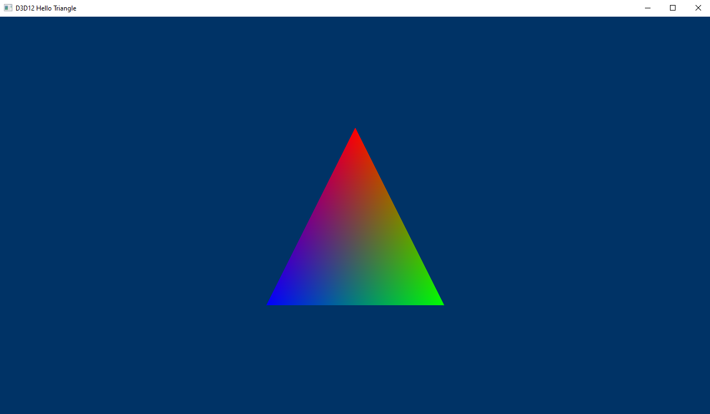

# DirectX 12 "HelloTriangle" Example

This is the basic rendering triangle you see in every graphics API, it's the example you can find in the [Microsoft Repository](https://github.com/microsoft/DirectX-Graphics-Samples/tree/master/Samples/Desktop/D3D12HelloWorld/src/HelloTriangle) with a bit of cleaning and a couple of fixes. It contains also a VS Solution (.sln) you can use to build and execute it.

This is not particularly useful for DXR, but is used as starting point for the next tutorial, and so can be used to compare the differences between a basic triangle rendering and the Raytraced triangle.

## Points of interest
* The window is created at [Win32Application.cpp#L39](https://github.com/ScrappyCocco/DirectX-DXR-Tutorials/blob/master/00-BasicDxTriangle/Project/Win32Application.cpp#L39), while the window events are managed here: [Win32Application.cpp#L80](https://github.com/ScrappyCocco/DirectX-DXR-Tutorials/blob/master/00-BasicDxTriangle/Project/Win32Application.cpp#L80);
* The main rendering code steps are:
  1. [D3D12HelloTriangle.cpp#L26](https://github.com/ScrappyCocco/DirectX-DXR-Tutorials/blob/master/00-BasicDxTriangle/Project/D3D12HelloTriangle.cpp#L26) is the Init() call that initialize the device, the basic pipeline and the assets;
  2. [D3D12HelloTriangle.cpp#L264](https://github.com/ScrappyCocco/DirectX-DXR-Tutorials/blob/master/00-BasicDxTriangle/Project/D3D12HelloTriangle.cpp#L264) is the main rendering loop, that register the rendering commands, execute them, and present the result;
  3. [D3D12HelloTriangle.cpp#L324](https://github.com/ScrappyCocco/DirectX-DXR-Tutorials/blob/master/00-BasicDxTriangle/Project/D3D12HelloTriangle.cpp#L324) wait for the previous frame, and as it says **is not a best practice**, but for this example is not really important.
