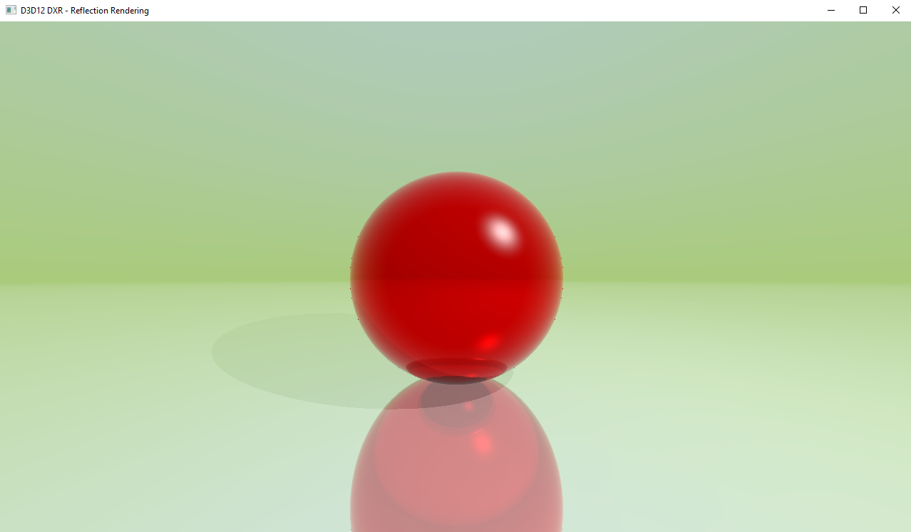

# Reflection Rendering
This example shows how to make reflection meshes using Raytracing pipeline. In this example, we are going to add a third reflected ray for each hit point recursively to calculate the final color (4 rebounds maximum deep). There is also fresnel and visibility falloff to improve the render.

This is an example i found from Jorge Cantón, that you can find here: [Jorgemagic/CSharpDirectXRaytracing](https://github.com/Jorgemagic/CSharpDirectXRaytracing). The project structure is the same too, because i found it quite clean and easy to read.

## Points of interest
See the [Important Concepts](CONCEPTS.md) document, that you can find in this folder.
