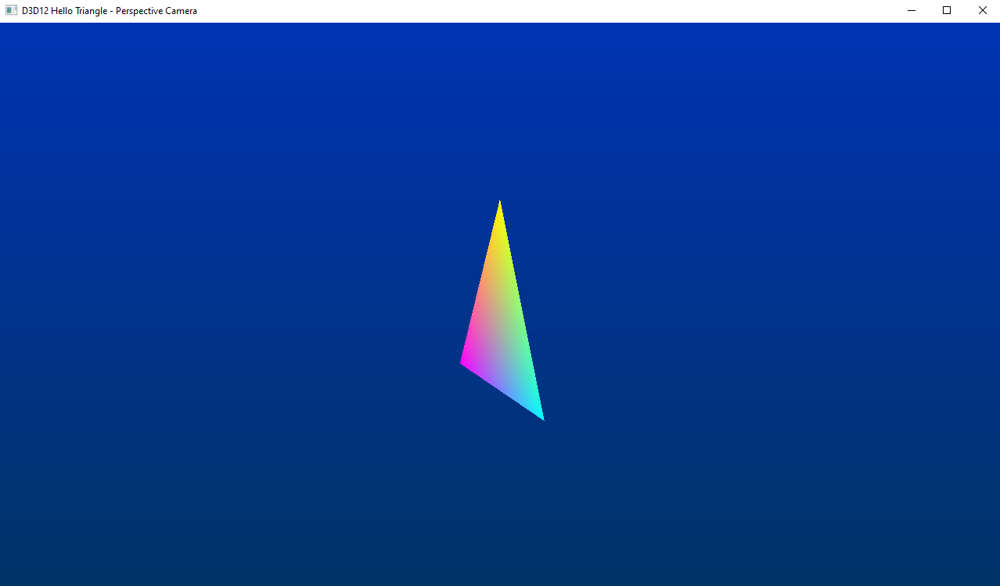

# [Nvidia] DXR "HelloTriangle" - Perspective Camera
This is the Raytracing triangle of Tutorial 1, extended using a more "natural" perspective camera.

As in tutorial 1, you can switch between the standard rasterized version (default) and the raytraced version (the one in the screenshot) by pressing SPACE.

This is a tutorial made by Nvidia, that you can find here: [Tutorial - Extras - Perspective Camera](https://developer.nvidia.com/rtx/raytracing/dxr/DX12-Raytracing-tutorial/Extra/dxr_tutorial_extra_perspective)

Huge thanks to [Martin-Karl Lefrançois](https://devblogs.nvidia.com/author/mlefrancois/) and [Pascal Gautron](https://devblogs.nvidia.com/author/pgautron/) that made this tutorial, all this work is theirs.

## Points of interest
See the [Important Concepts](CONCEPTS.md) document, that you can find in this folder.

## Further reading
* [Nvidia DX12 Raytracing tutorial Helpers Classes](https://developer.nvidia.com/rtx/raytracing/dxr/DX12-Raytracing-tutorial/dxr_tutorial_helpers)