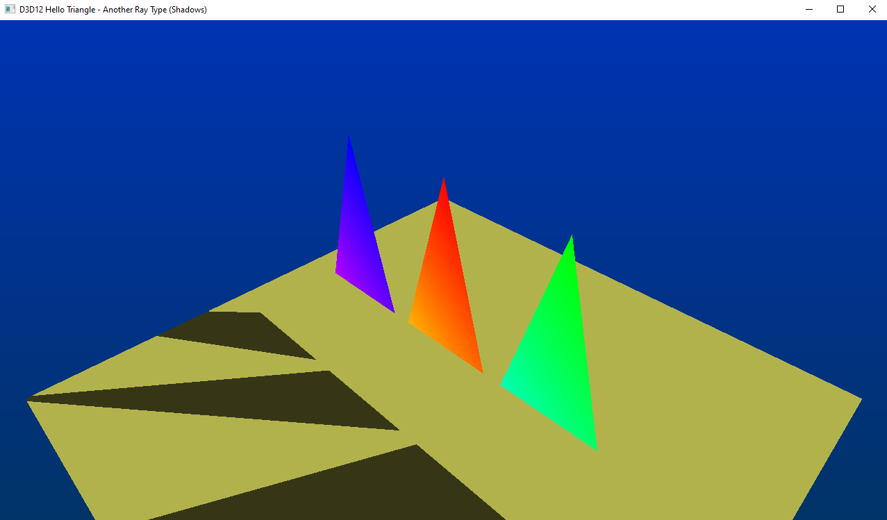

# [Nvidia] DXR "HelloTriangle" - Another Ray Type (Shadows)
This is the Raytracing triangles of Tutorial 3, done with multiple geometry in a single scene, with the addition of another ray type, used for shadows.

This is a tutorial made by Nvidia, that you can find here: [Tutorial - Extras - Per Instance Data](https://developer.nvidia.com/rtx/raytracing/dxr/DX12-Raytracing-tutorial/Extra/dxr_tutorial_extra_per_instance_data).

Huge thanks to [Martin-Karl Lefrançois](https://devblogs.nvidia.com/author/mlefrancois/) and [Pascal Gautron](https://devblogs.nvidia.com/author/pgautron/) that made this tutorial, all this work is theirs.

## Points of interest
See the [Important Concepts](CONCEPTS.md) document, that you can find in this folder.

## Further reading
* [Nvidia DX12 Raytracing tutorial Helpers Classes](https://developer.nvidia.com/rtx/raytracing/dxr/DX12-Raytracing-tutorial/dxr_tutorial_helpers)