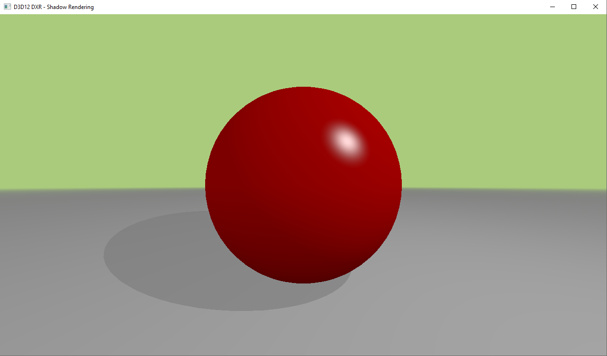

# Shadow Rendering
This example shows how to project shadows using Raytracing pipeline. In this example, there is a second geometry (ground) in the Acceleration Structure and we throw a second ray to know whether a hit point is in shadow.

This is an example i found from Jorge Cantón, that you can find here: [Jorgemagic/CSharpDirectXRaytracing](https://github.com/Jorgemagic/CSharpDirectXRaytracing). The project structure is the same too, because i found it quite clean and easy to read.

## Points of interest
See the [Important Concepts](CONCEPTS.md) document, that you can find in this folder.
